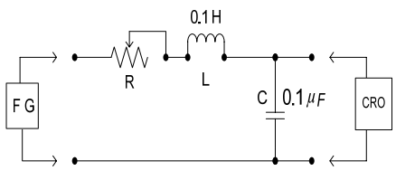
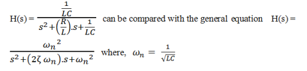
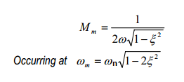

# Introduction

Series RLC circuits consist of a resistance, a capacitance and an inductance connected in series across an alternating supply. Series RLC circuits are classed as second-order circuits because they contain two energy storage elements, an inductance L and a capacitance C. Consider the RLC circuit below. In this experiment a circuit(Fig 1) will be provided. A p-p sinusoidal signal of amplitude 3V will be applied to it and its frequency response would be verified .

  
 
***Figure 1:Circuit diagram***

The above R, L, C series circuit forms a second order system.The transfer function of this circuit is given by,
  

The gain and phase response against frequency will be typical of second order system. The expected maximum gain for each ζ can be observed from the plot in the experiment. Theoretical expression for obtaining maximum gain is,

